# アルゴリズム（トレース表） 練習問題

### 演習1
トレース表を完成させてください。

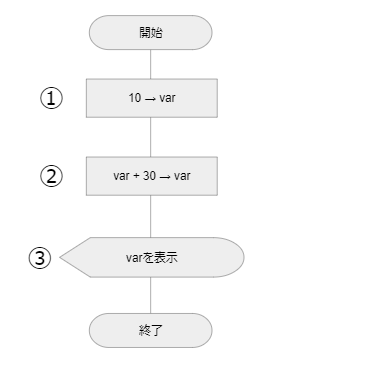

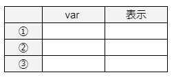

 

### 演習2
トレース表を完成させてください。

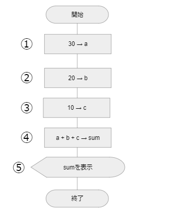

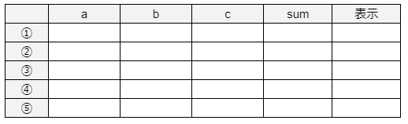

 

### 演習3
トレース表を完成させてください。

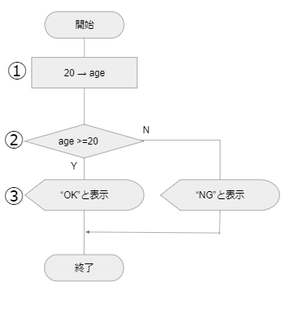

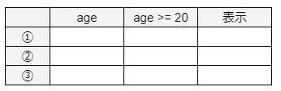

 

### 演習4
トレース表を完成させてください。

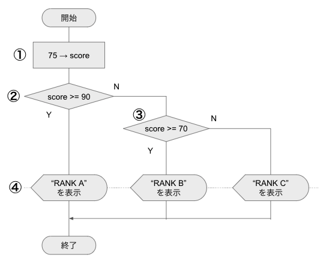

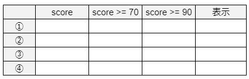

 

### 演習5
トレース表を完成させてください。

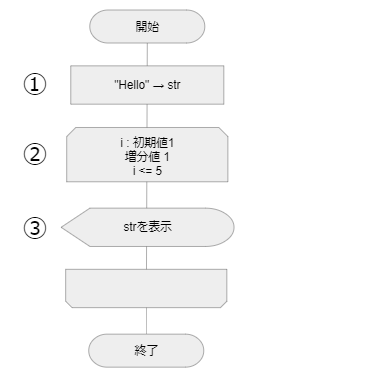

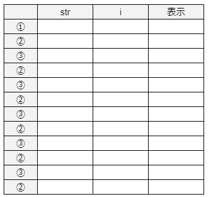

 

### 演習6
トレース表を完成させてください。

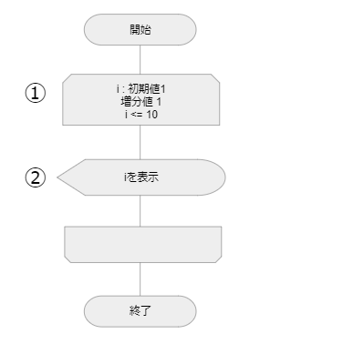

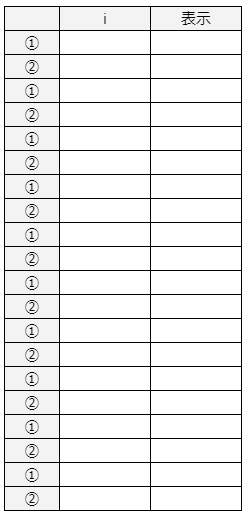

 

### 演習7
トレース表を完成させてください。

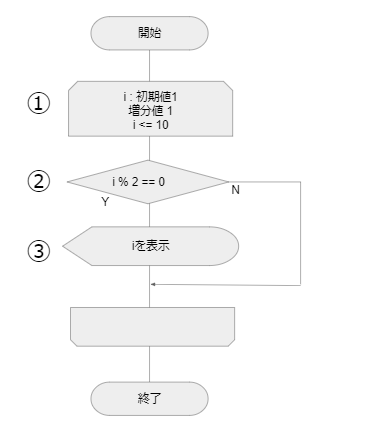

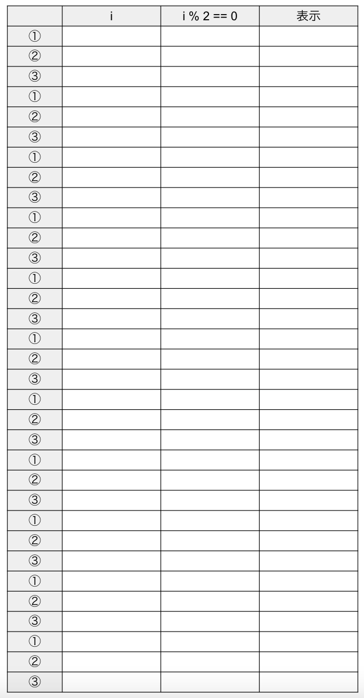